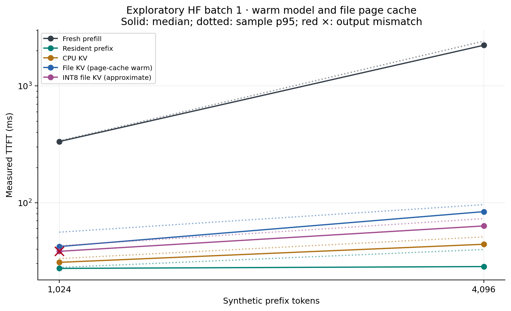
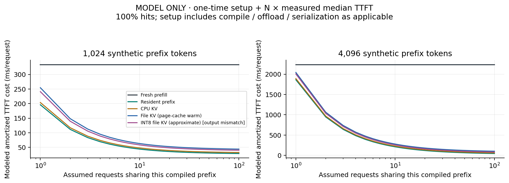
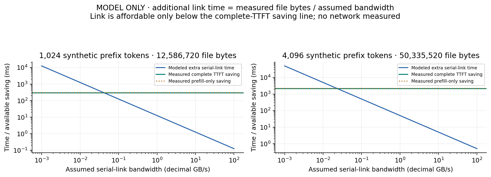

# Baseline measurement report

**Scope: measured Hugging Face batch-1 inference on synthetic repeated text. File page cache is warm/uncontrolled. Native vLLM/LMCache controls are pending.**

This report recalculates descriptive statistics from raw.jsonl and checks summary.json for agreement. It does not generate or replace measurements.

## Findings and validity

**Exact-output mismatches: 7.** Affected modes cannot be described as exact-equivalent on this run.

At 1,024 prefix tokens, fresh median TTFT was 334.048 ms and resident-prefix TTFT 27.314 ms. File reuse was 14.710 ms slower than resident-prefix reuse.

At 4,096 prefix tokens, fresh median TTFT was 2235.775 ms and resident-prefix TTFT 28.318 ms. File reuse was 55.429 ms slower than resident-prefix reuse.

### Run warnings

- EXPLORATORY PROVENANCE: no run-time Git commit was recorded. A source-file hash is available, but a later clean, pinned run is needed for published claims.
- The run recorded an unclean Git tree; preserve input/source hashes and rerun from a pinned clean revision.
- 1024 tokens / cold_prefill: only 7 trials; p95 is exploratory.
- 1024 tokens / cpu_kv: only 7 trials; p95 is exploratory.
- 1024 tokens / hot_prefix: only 7 trials; p95 is exploratory.
- 1024 tokens / int8_kv: only 7 trials; p95 is exploratory.
- EXACT OUTPUT FAILURE: 1024 tokens / int8_kv: 7/7 differ from the reference.
- 1024 tokens / persistent_kv: only 7 trials; p95 is exploratory.
- 4096 tokens / cold_prefill: only 7 trials; p95 is exploratory.
- 4096 tokens / cpu_kv: only 7 trials; p95 is exploratory.
- 4096 tokens / hot_prefix: only 7 trials; p95 is exploratory.
- 4096 tokens / int8_kv: only 7 trials; p95 is exploratory.
- 4096 tokens / persistent_kv: only 7 trials; p95 is exploratory.
- Artifact status at 16384 tokens: out_of_memory; incomplete lengths omitted.
- Configured observation absent: 16384 tokens / cold_prefill.
- Configured observation absent: 16384 tokens / hot_prefix.
- Configured observation absent: 16384 tokens / cpu_kv.
- Configured observation absent: 16384 tokens / persistent_kv.
- Configured observation absent: 16384 tokens / int8_kv.
- Configured observation absent: 32704 tokens / cold_prefill.
- Configured observation absent: 32704 tokens / hot_prefix.
- Configured observation absent: 32704 tokens / cpu_kv.
- Configured observation absent: 32704 tokens / persistent_kv.
- Configured observation absent: 32704 tokens / int8_kv.

## Measured request timings

Recorded query length: 32 tokens; output budget: 16 tokens; batch size: 1.

Ratios compare measured medians. A ratio above 1 favors the row over its stated control. Resident-prefix is the strongest available reuse control; it excludes cache construction just as other request rows do.

| Prefix tokens | Mode | n | Median TTFT ms | p95 ms | Variance ms² | Fresh / row | Resident / row | Exact outputs | Max logit error |
|---:|---|---:|---:|---:|---:|---:|---:|---|---:|
| 1024 | Fresh prefill | 7 | 334.048 | 338.049 | 2,603.062 | 1.000 | 0.082 | 7/7 | 0.000 |
| 1024 | CPU KV | 7 | 30.785 | 33.156 | 3.175 | 10.851 | 0.887 | 7/7 | 0.035 |
| 1024 | Resident prefix | 7 | 27.314 | 27.835 | 0.596 | 12.230 | 1.000 | 7/7 | 0.035 |
| 1024 | INT8 file KV (approximate) | 7 | 38.276 | 42.659 | 11.201 | 8.727 | 0.714 | **FAIL 0/7** | 0.495 |
| 1024 | File KV (page-cache warm) | 7 | 42.023 | 55.832 | 44.212 | 7.949 | 0.650 | 7/7 | 0.035 |
| 4096 | Fresh prefill | 7 | 2,235.775 | 2,425.114 | 31,809.492 | 1.000 | 0.013 | 7/7 | 0.000 |
| 4096 | CPU KV | 7 | 44.000 | 50.893 | 42.868 | 50.813 | 0.644 | 7/7 | 0.039 |
| 4096 | Resident prefix | 7 | 28.318 | 39.663 | 29.302 | 78.951 | 1.000 | 7/7 | 0.039 |
| 4096 | INT8 file KV (approximate) | 7 | 63.161 | 72.988 | 36.284 | 35.398 | 0.448 | 7/7 | 0.648 |
| 4096 | File KV (page-cache warm) | 7 | 83.748 | 96.174 | 36.848 | 26.697 | 0.338 | 7/7 | 0.039 |



[SVG chart](ttft_vs_length.svg)

## Setup and amortization model

The setup sum is compile-only for resident state; compile + offload for CPU; compile + offload + serialize/hash/fsync for file; compile + offload + quantize + INT8 serialization for INT8. The unrelated full-precision file serialization is not charged to INT8. Model load and tokenization are common/excluded costs. Each setup component is one observation, not a median.

Model: total TTFT cost(N) = setup_ms + N × median_request_TTFT_ms. Strict break-even is the first integer N whose modeled total is lower than fresh prefill. This is not observed multi-request throughput and excludes subsequent decode. No finite break-even is claimed when the request itself is slower. A reported N=1 can reflect a single setup sample below the separately measured cold median, different prefill shapes, or timing variation; it is not proof that preparation is free. Repeated paired setup+request measurements are needed to confirm that boundary.

| Prefix | Mode | Setup ms | File bytes | Strict N vs fresh | Token-output gate |
|---:|---|---:|---:|---|---|
| 1024 | CPU KV | 173.076 | 0 | 1 | matched tested tokens only |
| 1024 | Resident prefix | 168.810 | 0 | 1 | matched tested tokens only |
| 1024 | INT8 file KV (approximate) | 202.818 | 6,298,840 | 1 | FAIL: mismatch |
| 1024 | File KV (page-cache warm) | 212.667 | 12,586,720 | 1 | matched tested tokens only |
| 4096 | CPU KV | 1846.252 | 0 | 1 | matched tested tokens only |
| 4096 | Resident prefix | 1833.830 | 0 | 1 | matched tested tokens only |
| 4096 | INT8 file KV (approximate) | 1942.029 | 25,173,272 | 1 | matched tested tokens only |
| 4096 | File KV (page-cache warm) | 1958.179 | 50,335,520 | 1 | matched tested tokens only |



[SVG chart](amortization_modeled.svg)

## Transfer bandwidth sensitivity model

For an additional serial hop: transfer_ms = measured_full_KV_file_bytes / (assumed_GBps × 10⁹) × 1000. The declining curve is that modeled added time; horizontal lines are measured (fresh TTFT − warm-file TTFT) and (fresh prefill − cached suffix prefill). The latter is an optimistic compute-only budget that excludes preparation. An added link is affordable only when its curve falls below the complete-TTFT saving line. The file path and its preparation remain in the solid model, so transfer is an added hop, not a replacement disk-speed estimate. Curves are not empirical network measurements and do not model overlap or congestion.



[SVG chart](transfer_sensitivity_modeled.svg)

## Measurement limitations

- Hugging Face Transformers, one process, batch size 1; these are not vLLM, SGLang or LMCache measurements and do not establish serving-system superiority.
- Weights/kernels are warm. Fresh prefill means no prefix reuse, not a cold model/server. TTFT excludes model loading, prompt tokenization, HTTP transport and scheduling queues.
- Input is synthetic repeated text with a fixed generated-token budget. Exact output identity and first-token logits do not establish task accuracy, instruction adherence or long-context quality.
- File loads follow file creation and repeated warmups: OS page cache is warm/uncontrolled. Physical cold-disk bandwidth and process-restart recovery are not measured by this harness.
- The measured file path validates the file hash and loads tensors; its preparation time combines validation, deserialization, conversion and host-to-device transfer. Their separate costs are unavailable.
- The current harness provisions resident GPU state only for the hot condition outside request timing. GPU peaks still include model weights and allocator behavior; they are not incremental cache sizes. No GPU utilization or energy claim is supported.
- Payload and host-to-device counters describe logical file/tensor bytes, not measured physical traffic: hashing plus loading can access bytes repeatedly. Physical storage reads are explicitly unavailable.
- Setup components were measured once per length. Amortization assumes every later request hits, stationary latency, no eviction and no further validation/invalidation costs beyond measured TTFT.
- Transfer curves add an unmeasured serial network hop to the measured warm-file path. No network, RDMA, cold storage, concurrency, larger-model or other-hardware result is extrapolated as measured.
- Median and p95 are descriptive sample statistics, not confidence bounds. Seven trials are insufficient for a stable tail-latency claim; even more trials do not replace representative workload diversity.

## Reproduction and provenance

Recorded command:

```text
C:\Users\vardh\Documents\ChatGPT\NeuralPack\.venv\Scripts\python.exe -m benchmarks.model_baseline --config experiments\baseline.json
```

Recorded environment:

```json
{
  "os": "Windows-11-10.0.26200-SP0",
  "python": "3.12.10 (tags/v3.12.10:0cc8128, Apr  8 2025, 12:21:36) [MSC v.1943 64 bit (AMD64)]",
  "torch": "2.8.0+cu126",
  "transformers": "4.57.6",
  "cuda": "12.6",
  "gpu": "NVIDIA GeForce RTX 3050, 8192 MiB, 616.64, 00000000:01:00.0",
  "cpu": "Intel64 Family 6 Model 151 Stepping 2, GenuineIntel",
  "logical_cpus": 12,
  "ram_bytes": 17026183168,
  "git": {
    "commit": null,
    "status": "A  .gitignore\nA  LICENSE\nA  \"Neural Pack/.obsidian/app.json\"\nA  \"Neural Pack/Engineering/Baseline.md\"\nA  \"Neural Pack/Engineering/Corpus.md\"\nA  \"Neural Pack/Home.md\"\nA  \"Neural Pack/Journal/2026-09-05.md\"\nA  \"Neural Pack/Mission.md\"\nA  \"Neural Pack/Research/Systems.md\"\nA  \"Neural Pack/Research/Transfer.md\"\nA  README.md\nA  RESEARCH_LOG.md\nA  benchmarks/CORPUS.md\nA  benchmarks/__init__.py\nA  benchmarks/corpus.py\nA  benchmarks/model_baseline.py\nA  benchmarks/quality.py\nA  docs/decisions/0001-evidence-before-format.md\nA  experiments/baseline.json\nA  experiments/disk-initial.json\nA  experiments/hardware-initial.json\nA  experiments/model-provenance.json\nA  experiments/requirements-lock.txt\nA  experiments/smoke-fixed.json\nA  experiments/smoke.json\nA  npk/compatibility.py\nA  npk/optimizer.py\nA  pyproject.toml\nA  research/failures/0001-windows-fsync.md\nA  research/landscape.md\nA  research/papers.md\nA  research/systems.md\nA  research/unsolved-problems.md\nA  scripts/download_model.py\nA  tests/test_corpus.py\nA  tests/test_planner.py\n?? experiments/results/\n?? npk/__init__.py\n?? npk/format.py"
  },
  "timestamp_utc": "2026-09-05T23:41:08Z",
  "source_hash": "380c1cf90bb838c9e9ba2c09da31924c0f70fdb911d8d2e033d08f4c2a2cbfc6",
  "command": "C:\\Users\\vardh\\Documents\\ChatGPT\\NeuralPack\\.venv\\Scripts\\python.exe -m benchmarks.model_baseline --config experiments\\baseline.json",
  "limitations": [
    "Single-process batch-1 Transformers; not vLLM/LMCache throughput",
    "Weights and kernels warm; raw prefill means no reusable prefix state",
    "Persistent files are OS-page-cache warm/uncontrolled; physical cold-disk not measured",
    "Tokenized synthetic repeated text, not a quality corpus or natural prompt distribution",
    "No network transfer benchmark; cost curves outside this host are modeled"
  ],
  "model_load_and_verify_ms": 1506.3985,
  "fingerprint": "29be661ef4315a8d8ff35a25ce733d7721bf60ec8ebb51051c79686089738812",
  "effective_dtype": "torch.float16",
  "device": "cuda"
}
```

Recorded configuration:

```json
{
  "seed": 1729,
  "model_path": "experiments/models/Qwen2.5-0.5B-Instruct",
  "context_lengths": [
    1024,
    4096,
    16384,
    32704
  ],
  "query_tokens": 32,
  "output_tokens": 16,
  "trials": 7,
  "warmup_trials": 2,
  "dtype": "float16",
  "attention": "sdpa",
  "batch_size": 1,
  "threads": 4,
  "modes": [
    "cold_prefill",
    "hot_prefix",
    "cpu_kv",
    "persistent_kv",
    "int8_kv"
  ],
  "output_dir": "experiments/results/baseline"
}
```

Source/input digests:

| File | SHA-256 |
|---|---|
| [summary.json](summary.json) | `f4f971ff61c9562fcd06d80a71bc19432f1aa2a46a3983c1558002fb56e3b340` |
| [raw.jsonl](raw.jsonl) | `990f7c6384bf1784ccac9bcb08ea34991822114c2495b38457bd6e2bc77c78f6` |
| [artifacts.json](artifacts.json) | `67f945da52382943dbd851a58b8c85e78f1c5826a58eb0d7b62b156108f60240` |
| [environment.json](environment.json) | `c740c57a003a85b8581a306ae9f8ae07d5f3aaeac4c4901083ac60cd6464c242` |
| [config.json](config.json) | `be3afc1a2ea2781e3a0f577c0ebeef5ae04e3eab4e41f64df3e537b1f4239ba2` |
| report generator | `e2e8f79f13a08c619d89e705b0c39bab34802a886e9a1056dcf23d705069bbfb` |
