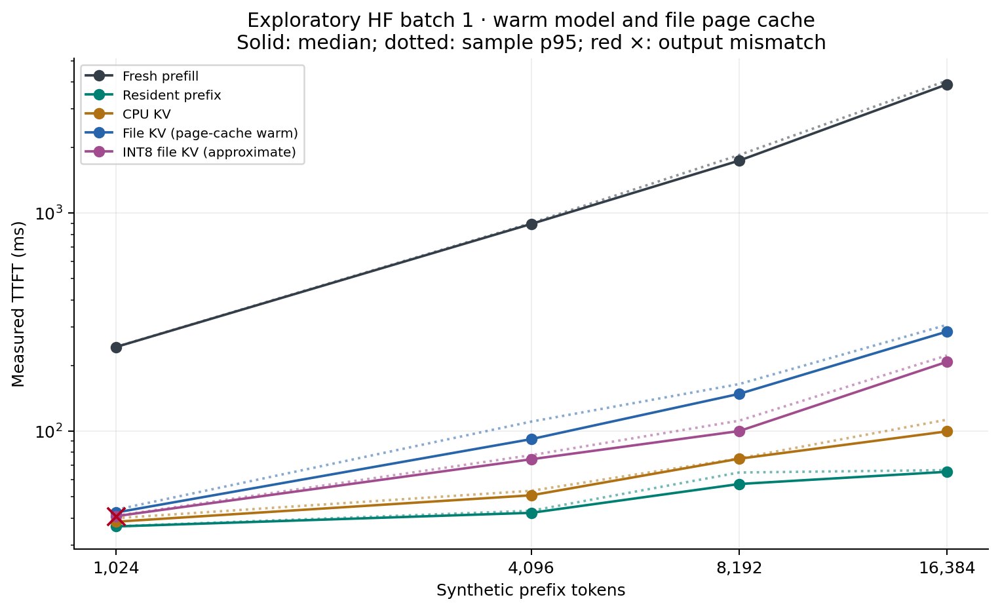
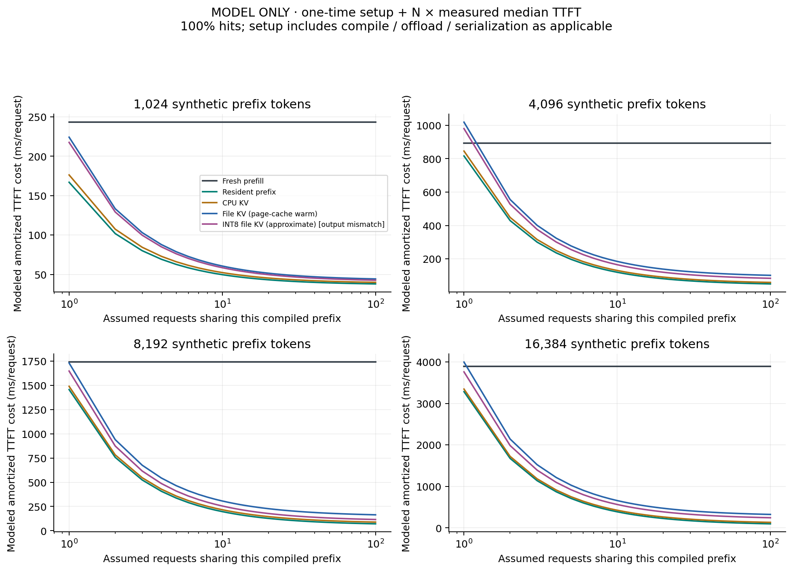
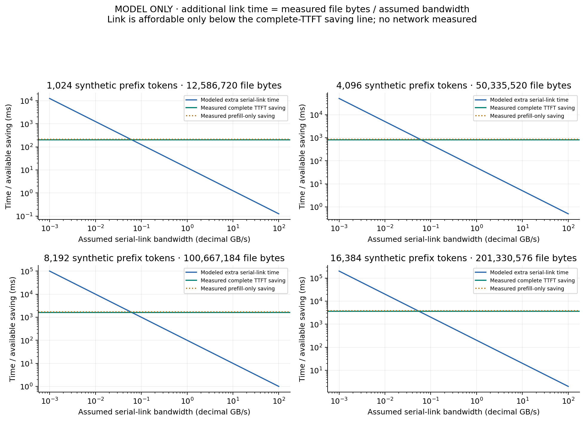

# Baseline measurement report

**Scope: measured Hugging Face batch-1 inference on synthetic repeated text. File page cache is warm/uncontrolled. Native vLLM/LMCache controls are pending.**

This report recalculates descriptive statistics from raw.jsonl and checks summary.json for agreement. It does not generate or replace measurements.

## Findings and validity

**Exact-output mismatches: 3.** Affected modes cannot be described as exact-equivalent on this run.

At 1,024 prefix tokens, fresh median TTFT was 243.284 ms and resident-prefix TTFT 36.621 ms. File reuse was 5.787 ms slower than resident-prefix reuse.

At 4,096 prefix tokens, fresh median TTFT was 892.366 ms and resident-prefix TTFT 42.286 ms. File reuse was 49.774 ms slower than resident-prefix reuse.

At 8,192 prefix tokens, fresh median TTFT was 1740.102 ms and resident-prefix TTFT 57.312 ms. File reuse was 91.072 ms slower than resident-prefix reuse.

At 16,384 prefix tokens, fresh median TTFT was 3890.052 ms and resident-prefix TTFT 65.207 ms. File reuse was 221.146 ms slower than resident-prefix reuse.

### Run warnings

- The run recorded an unclean Git tree; preserve input/source hashes and rerun from a pinned clean revision.
- 1024 tokens / cold_prefill: only 3 trials; p95 is exploratory.
- 1024 tokens / cpu_kv: only 3 trials; p95 is exploratory.
- 1024 tokens / hot_prefix: only 3 trials; p95 is exploratory.
- 1024 tokens / int8_kv: only 3 trials; p95 is exploratory.
- EXACT OUTPUT FAILURE: 1024 tokens / int8_kv: 3/3 differ from the reference.
- 1024 tokens / persistent_kv: only 3 trials; p95 is exploratory.
- 4096 tokens / cold_prefill: only 3 trials; p95 is exploratory.
- 4096 tokens / cpu_kv: only 3 trials; p95 is exploratory.
- 4096 tokens / hot_prefix: only 3 trials; p95 is exploratory.
- 4096 tokens / int8_kv: only 3 trials; p95 is exploratory.
- 4096 tokens / persistent_kv: only 3 trials; p95 is exploratory.
- 8192 tokens / cold_prefill: only 3 trials; p95 is exploratory.
- 8192 tokens / cpu_kv: only 3 trials; p95 is exploratory.
- 8192 tokens / hot_prefix: only 3 trials; p95 is exploratory.
- 8192 tokens / int8_kv: only 3 trials; p95 is exploratory.
- 8192 tokens / persistent_kv: only 3 trials; p95 is exploratory.
- 16384 tokens / cold_prefill: only 3 trials; p95 is exploratory.
- 16384 tokens / cpu_kv: only 3 trials; p95 is exploratory.
- 16384 tokens / hot_prefix: only 3 trials; p95 is exploratory.
- 16384 tokens / int8_kv: only 3 trials; p95 is exploratory.
- 16384 tokens / persistent_kv: only 3 trials; p95 is exploratory.

## Measured request timings

Recorded query length: 32 tokens; output budget: 16 tokens; batch size: 1.

Ratios compare measured medians. A ratio above 1 favors the row over its stated control. Resident-prefix is the strongest available reuse control; it excludes cache construction just as other request rows do.

| Prefix tokens | Mode | n | Median TTFT ms | p95 ms | Variance ms² | Fresh / row | Resident / row | Exact outputs | Max logit error |
|---:|---|---:|---:|---:|---:|---:|---:|---|---:|
| 1024 | Fresh prefill | 3 | 243.284 | 243.605 | 0.085 | 1.000 | 0.151 | 3/3 | 0.000 |
| 1024 | CPU KV | 3 | 38.495 | 39.961 | 15.260 | 6.320 | 0.951 | 3/3 | 0.000 |
| 1024 | Resident prefix | 3 | 36.621 | 36.670 | 16.084 | 6.643 | 1.000 | 3/3 | 0.000 |
| 1024 | INT8 file KV (approximate) | 3 | 40.804 | 40.981 | 1.019 | 5.962 | 0.897 | **FAIL 0/3** | 0.514 |
| 1024 | File KV (page-cache warm) | 3 | 42.408 | 43.687 | 0.460 | 5.737 | 0.864 | 3/3 | 0.000 |
| 4096 | Fresh prefill | 3 | 892.366 | 900.619 | 24.197 | 1.000 | 0.047 | 3/3 | 0.000 |
| 4096 | CPU KV | 3 | 50.882 | 53.383 | 2.828 | 17.538 | 0.831 | 3/3 | 0.000 |
| 4096 | Resident prefix | 3 | 42.286 | 43.223 | 5.811 | 21.103 | 1.000 | 3/3 | 0.000 |
| 4096 | INT8 file KV (approximate) | 3 | 74.446 | 77.738 | 18.958 | 11.987 | 0.568 | 3/3 | 0.609 |
| 4096 | File KV (page-cache warm) | 3 | 92.060 | 110.766 | 104.138 | 9.693 | 0.459 | 3/3 | 0.000 |
| 8192 | Fresh prefill | 3 | 1,740.102 | 1,845.631 | 5,489.583 | 1.000 | 0.033 | 3/3 | 0.000 |
| 8192 | CPU KV | 3 | 74.829 | 75.153 | 60.973 | 23.254 | 0.766 | 3/3 | 0.000 |
| 8192 | Resident prefix | 3 | 57.312 | 64.720 | 85.246 | 30.362 | 1.000 | 3/3 | 0.000 |
| 8192 | INT8 file KV (approximate) | 3 | 100.201 | 111.810 | 46.581 | 17.366 | 0.572 | 3/3 | 0.594 |
| 8192 | File KV (page-cache warm) | 3 | 148.385 | 164.556 | 95.564 | 11.727 | 0.386 | 3/3 | 0.000 |
| 16384 | Fresh prefill | 3 | 3,890.052 | 4,048.270 | 21,835.453 | 1.000 | 0.017 | 3/3 | 0.000 |
| 16384 | CPU KV | 3 | 99.882 | 113.019 | 152.684 | 38.947 | 0.653 | 3/3 | 0.000 |
| 16384 | Resident prefix | 3 | 65.207 | 66.377 | 2.887 | 59.657 | 1.000 | 3/3 | 0.000 |
| 16384 | INT8 file KV (approximate) | 3 | 208.039 | 222.556 | 166.363 | 18.699 | 0.313 | 3/3 | 0.426 |
| 16384 | File KV (page-cache warm) | 3 | 286.353 | 307.484 | 146.111 | 13.585 | 0.228 | 3/3 | 0.000 |



[SVG chart](ttft_vs_length.svg)

## Setup and amortization model

The setup sum is compile-only for resident state; compile + offload for CPU; compile + offload + serialize/hash/fsync for file; compile + offload + quantize + INT8 serialization for INT8. The unrelated full-precision file serialization is not charged to INT8. Model load and tokenization are common/excluded costs. Each setup component is one observation, not a median.

Model: total TTFT cost(N) = setup_ms + N × median_request_TTFT_ms. Strict break-even is the first integer N whose modeled total is lower than fresh prefill. This is not observed multi-request throughput and excludes subsequent decode. No finite break-even is claimed when the request itself is slower. A reported N=1 can reflect a single setup sample below the separately measured cold median, different prefill shapes, or timing variation; it is not proof that preparation is free. Repeated paired setup+request measurements are needed to confirm that boundary.

| Prefix | Mode | Setup ms | File bytes | Strict N vs fresh | Token-output gate |
|---:|---|---:|---:|---|---|
| 1024 | CPU KV | 137.785 | 0 | 1 | matched tested tokens only |
| 1024 | Resident prefix | 130.363 | 0 | 1 | matched tested tokens only |
| 1024 | INT8 file KV (approximate) | 176.798 | 6,298,840 | 1 | FAIL: mismatch |
| 1024 | File KV (page-cache warm) | 181.822 | 12,586,720 | 1 | matched tested tokens only |
| 4096 | CPU KV | 795.010 | 0 | 1 | matched tested tokens only |
| 4096 | Resident prefix | 774.183 | 0 | 1 | matched tested tokens only |
| 4096 | INT8 file KV (approximate) | 905.892 | 25,173,272 | 2 | matched tested tokens only |
| 4096 | File KV (page-cache warm) | 926.905 | 50,335,520 | 2 | matched tested tokens only |
| 8192 | CPU KV | 1415.109 | 0 | 1 | matched tested tokens only |
| 8192 | Resident prefix | 1399.243 | 0 | 1 | matched tested tokens only |
| 8192 | INT8 file KV (approximate) | 1547.517 | 50,339,120 | 1 | matched tested tokens only |
| 8192 | File KV (page-cache warm) | 1582.397 | 100,667,184 | 1 | matched tested tokens only |
| 16384 | CPU KV | 3244.941 | 0 | 1 | matched tested tokens only |
| 16384 | Resident prefix | 3217.210 | 0 | 1 | matched tested tokens only |
| 16384 | INT8 file KV (approximate) | 3551.092 | 100,670,824 | 1 | matched tested tokens only |
| 16384 | File KV (page-cache warm) | 3708.914 | 201,330,576 | 2 | matched tested tokens only |



[SVG chart](amortization_modeled.svg)

## Transfer bandwidth sensitivity model

For an additional serial hop: transfer_ms = measured_full_KV_file_bytes / (assumed_GBps × 10⁹) × 1000. The declining curve is that modeled added time; horizontal lines are measured (fresh TTFT − warm-file TTFT) and (fresh prefill − cached suffix prefill). The latter is an optimistic compute-only budget that excludes preparation. An added link is affordable only when its curve falls below the complete-TTFT saving line. The file path and its preparation remain in the solid model, so transfer is an added hop, not a replacement disk-speed estimate. Curves are not empirical network measurements and do not model overlap or congestion.



[SVG chart](transfer_sensitivity_modeled.svg)

## Measurement limitations

- Hugging Face Transformers, one process, batch size 1; these are not vLLM, SGLang or LMCache measurements and do not establish serving-system superiority.
- Weights/kernels are warm. Fresh prefill means no prefix reuse, not a cold model/server. TTFT excludes model loading, prompt tokenization, HTTP transport and scheduling queues.
- Input is synthetic repeated text with a fixed generated-token budget. Exact output identity and first-token logits do not establish task accuracy, instruction adherence or long-context quality.
- File loads follow file creation and repeated warmups: OS page cache is warm/uncontrolled. Physical cold-disk bandwidth and process-restart recovery are not measured by this harness.
- The measured file path validates the file hash and loads tensors; its preparation time combines validation, deserialization, conversion and host-to-device transfer. Their separate costs are unavailable.
- The current harness provisions resident GPU state only for the hot condition outside request timing. GPU peaks still include model weights and allocator behavior; they are not incremental cache sizes. No GPU utilization or energy claim is supported.
- Payload and host-to-device counters describe logical file/tensor bytes, not measured physical traffic: hashing plus loading can access bytes repeatedly. Physical storage reads are explicitly unavailable.
- Setup components were measured once per length. Amortization assumes every later request hits, stationary latency, no eviction and no further validation/invalidation costs beyond measured TTFT.
- Transfer curves add an unmeasured serial network hop to the measured warm-file path. No network, RDMA, cold storage, concurrency, larger-model or other-hardware result is extrapolated as measured.
- Median and p95 are descriptive sample statistics, not confidence bounds. Seven trials are insufficient for a stable tail-latency claim; even more trials do not replace representative workload diversity.

## Reproduction and provenance

Recorded command:

```text
C:\Users\vardh\Documents\ChatGPT\NeuralPack\.venv\Scripts\python.exe -m benchmarks.model_baseline --config experiments/chunked.json
```

Recorded environment:

```json
{
  "os": "Windows-11-10.0.26200-SP0",
  "python": "3.12.10 (tags/v3.12.10:0cc8128, Apr  8 2025, 12:21:36) [MSC v.1943 64 bit (AMD64)]",
  "torch": "2.8.0+cu126",
  "transformers": "4.57.6",
  "cuda": "12.6",
  "gpu": "NVIDIA GeForce RTX 3050, 8192 MiB, 616.64, 00000000:01:00.0",
  "cpu": "Intel64 Family 6 Model 151 Stepping 2, GenuineIntel",
  "logical_cpus": 12,
  "ram_bytes": 17026183168,
  "git": {
    "commit": "64b48b22cf43bf29782317416c43f7e6fbd6a0e5",
    "status": "M experiments/chunked.json\n?? experiments/results/chunked/"
  },
  "timestamp_utc": "2026-09-06T00:26:07Z",
  "source_hash": "0c4a6ae9c2c8ea969adb3f11a62d245e4ae09bc6b9305344ec49046f5b7a7549",
  "command": "C:\\Users\\vardh\\Documents\\ChatGPT\\NeuralPack\\.venv\\Scripts\\python.exe -m benchmarks.model_baseline --config experiments/chunked.json",
  "limitations": [
    "Single-process batch-1 Transformers; not vLLM/LMCache throughput",
    "Weights and kernels warm; raw prefill means no reusable prefix state",
    "Persistent files are OS-page-cache warm/uncontrolled; physical cold-disk not measured",
    "Tokenized synthetic repeated text, not a quality corpus or natural prompt distribution",
    "No network transfer benchmark; cost curves outside this host are modeled"
  ],
  "model_load_and_verify_ms": 1717.8416,
  "fingerprint": "29be661ef4315a8d8ff35a25ce733d7721bf60ec8ebb51051c79686089738812",
  "effective_dtype": "torch.float16",
  "device": "cuda"
}
```

Recorded configuration:

```json
{
  "seed": 1729,
  "model_path": "experiments/models/Qwen2.5-0.5B-Instruct",
  "context_lengths": [
    1024,
    4096,
    8192,
    16384
  ],
  "query_tokens": 32,
  "output_tokens": 16,
  "trials": 3,
  "warmup_trials": 1,
  "dtype": "float16",
  "attention": "sdpa",
  "batch_size": 1,
  "threads": 4,
  "prefill_chunk_tokens": 256,
  "modes": [
    "cold_prefill",
    "hot_prefix",
    "cpu_kv",
    "persistent_kv",
    "int8_kv"
  ],
  "output_dir": "experiments/results/chunked"
}
```

Source/input digests:

| File | SHA-256 |
|---|---|
| [summary.json](summary.json) | `eebec560df8b0d449a412f3ffa37af0017fed39afb95c764cb8c11709e32661f` |
| [raw.jsonl](raw.jsonl) | `a00f490ef6f6106ed29c2135eb3e84fb0733719714fe487685630d1aa07599c3` |
| [artifacts.json](artifacts.json) | `c6706ae4bd1aecf6ae79fbdf6f8f3da9246dab11e06a193e2e19c60212a62a03` |
| [environment.json](environment.json) | `743cac6aaec2018d8ebdc8053d1a2b29c3ba0d5d8db0a382403ecda66bd2fcb0` |
| [config.json](config.json) | `73a405e7f3ffa6d1d985efa60fefda6a8f12c1900681517641173fc7183d587b` |
| report generator | `e2e8f79f13a08c619d89e705b0c39bab34802a886e9a1056dcf23d705069bbfb` |
